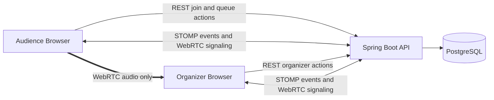

# VoiceBridge Architecture

```mermaid
flowchart LR
  audience[Audience Browser] -->|REST join and queue actions| backend[Spring Boot API]
  organizer[Organizer Browser] -->|REST organizer actions| backend
  backend --> postgres[(PostgreSQL)]
  audience <-->|STOMP events and WebRTC signaling| backend
  organizer <-->|STOMP events and WebRTC signaling| backend
  audience ==>|WebRTC audio only| organizer
```

Phase 1 establishes the monorepo, backend/frontend build foundations, PostgreSQL container, environment configuration, and documentation skeleton.
