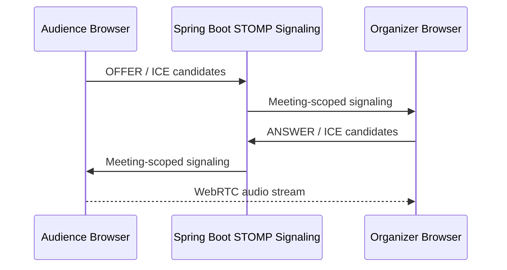

# WebRTC Architecture

Actual audio must flow peer-to-peer:

```mermaid
sequenceDiagram
  participant A as Audience Browser
  participant B as Spring Boot STOMP Signaling
  participant O as Organizer Browser
  A->>B: OFFER / ICE candidates
  B->>O: Meeting-scoped signaling
  O->>B: ANSWER / ICE candidates
  B->>A: Meeting-scoped signaling
  A-->>O: WebRTC audio stream
```

Spring Boot must never relay microphone audio through WebSocket.
