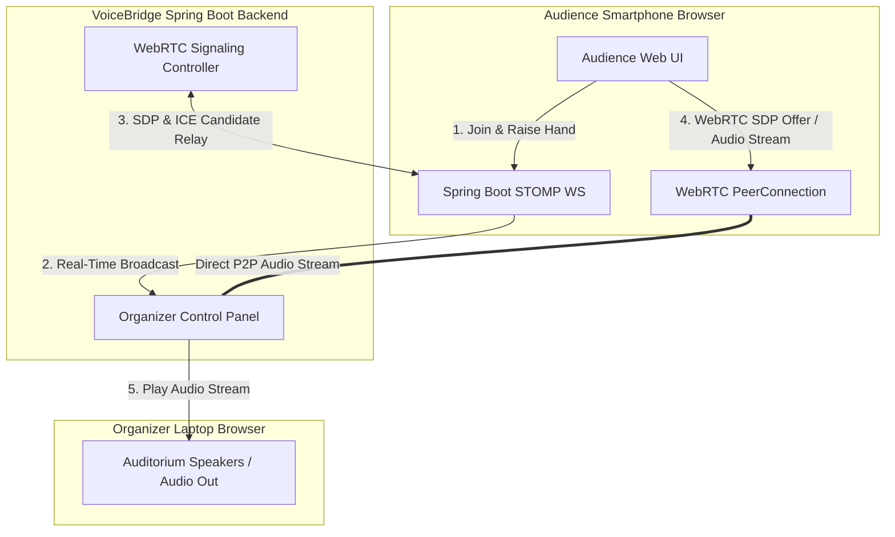
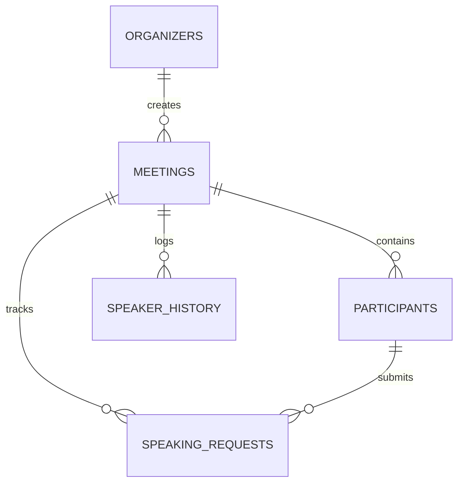

# Zeroth Project Review Presentation
## VoiceBridge – QR-Based Smart Audience Microphone System

**Domain**: Real-Time Communication & Full-Stack Systems  
**Tech Stack**: Java 21, Spring Boot 3, React 19, WebRTC, WebSocket (STOMP), PostgreSQL, Docker  

---

### Slide 1: Project Title & Abstract

#### **VoiceBridge – QR-Based Smart Audience Microphone System**

* **Problem Addressed**: Eliminates physical microphone carrying delays during large seminars, placement talks, classrooms, and conferences.
* **Core Solution**: An attendee scans an auditorium QR code on their smartphone browser (no app installation required), joins the session, and raises their hand. Upon organizer approval, their smartphone dynamically becomes a live wireless microphone streaming peer-to-peer audio directly to the speaker system.

---

### Slide 2: Problem Statement & Motivation

#### **Challenges in Existing Q&A Sessions**
1. **Time Wasted in Physical Mic Passing**: 30–40% of Q&A session time is spent walking physical wireless microphones across rows.
2. **Audio Feedback & Battery Issues**: Handheld microphones suffer from acoustic feedback, battery drain, and hygiene concerns.
3. **Queue Chaos**: Multiple audience members waving hands creates confusion for the host/presenter.

#### **Motivation for VoiceBridge**
* Smartphone ubiquitous adoption enables every audience member to bring their own microphone hardware.
* WebRTC allows low-latency P2P audio streaming directly within standard web browsers without native mobile apps.

---

### Slide 3: Project Objectives & Scope

1. **Zero Installation Access**: Instant browser access via QR code scanning.
2. **First-Come-First-Serve (FCFS) Hand-Raise Queue**: Structured, reorderable queue for the organizer to approve speakers sequentially.
3. **Single Active Speaker Enforcement**: Prevents audio overlap by enforcing that only one audience member can speak at any instant.
4. **Browser Audio Engine**: Real-time WebRTC audio with built-in Echo Cancellation, Noise Suppression, and Auto Gain Control.
5. **Real-Time Control Dashboard**: STOMP WebSocket notifications for participant joins, hand raises, approvals, and audio levels.

---

### Slide 4: System Architecture

---

### Slide 5: Real-Time Signaling & WebRTC Audio Engine

1. **Signaling Layer**:
   * STOMP WebSocket endpoints (`/ws`) handle real-time signaling frames (SDP Offer, SDP Answer, ICE Candidates).
   * Spring SimpMessagingTemplate broadcasts session state events to `/topic/meetings/{code}`.
2. **Audio Layer**:
   * Audio travels direct peer-to-peer (P2P) between audience browser and organizer browser.
   * `getUserMedia({ audio: { echoCancellation: true, noiseSuppression: true, autoGainControl: true } })`
   * AudioContext API provides live frequency analysis for real-time sound equalizers.

---

### Slide 6: Database & Entity Relationship Model

#### Primary Entities
* **Organizer**: Stores credentials, hashed passwords (BCrypt), and profile info.
* **Meeting**: Contains `meetingCode`, `title`, status (`ACTIVE`, `CLOSED`), timestamps.
* **Participant**: Session tokens, name, joined/left timestamps.
* **SpeakingRequest**: FCFS queue order, status (`WAITING`, `APPROVED`, `SPEAKING`, `FINISHED`, `REJECTED`).
* **SpeakerHistory**: Logs total speaking duration for session analytics.

---

### Slide 7: Software & Technology Stack

| Layer | Technologies Used |
| :--- | :--- |
| **Backend Core** | Java 21, Spring Boot 3.3.4, Spring Security, Spring Data JPA |
| **Real-Time Communication**| Spring WebSocket (STOMP), SockJS, WebRTC Peer-to-Peer |
| **Database & Migration** | PostgreSQL 16, Flyway Schema Migration |
| **Frontend Framework** | React 19, Vite, Tailwind CSS v4, React Router v6, Axios |
| **Media & QR Generation**| Web Audio API (AnalyserNode), ZXing QR Library, QRCode.react |
| **Deployment Stack** | Docker, Docker Compose, Nginx Reverse Proxy |

---

### Slide 8: Key Features & Demo Workflows

#### **1. Organizer Flow**
* Login -> Create Session -> Display QR Code on projector/screen -> View live connected audience.
* View Hand-Raise queue -> Approve Next Speaker -> Hear live audio output from auditorium speakers -> Click "End Speaker".

#### **2. Audience Flow**
* Scan QR -> Type Name -> Tap "Raise Hand" -> Receive "APPROVED" alert -> Grant Mic Permission -> "YOU ARE LIVE" visualizer -> Tap "Stop Speaking".

---

### Slide 9: Expected Outcomes & Innovation

* **Zero Hardware Expenses**: Removes dependency on buying extra physical wireless mics.
* **High Scalability**: WebRTC offloads media bandwidth from the backend server to direct peer connections.
* **Academic & Enterprise Impact**: Seamless Q&A execution for seminars, university lectures, and corporate AGMs.

---

### Slide 10: Conclusion & Zeroth Review Checklist

- [x] Backend architecture compiled cleanly (Java 21 Spring Boot)
- [x] Database migrations & ER schema fully designed (Flyway + PostgreSQL)
- [x] Real-Time WebRTC signaling & STOMP WebSocket implemented
- [x] Responsive React 19 UI built for Mobile & Desktop
- [x] Docker & Docker-Compose production configuration ready

---
*Prepared for Final Year Project Zeroth Review Presentation.*
